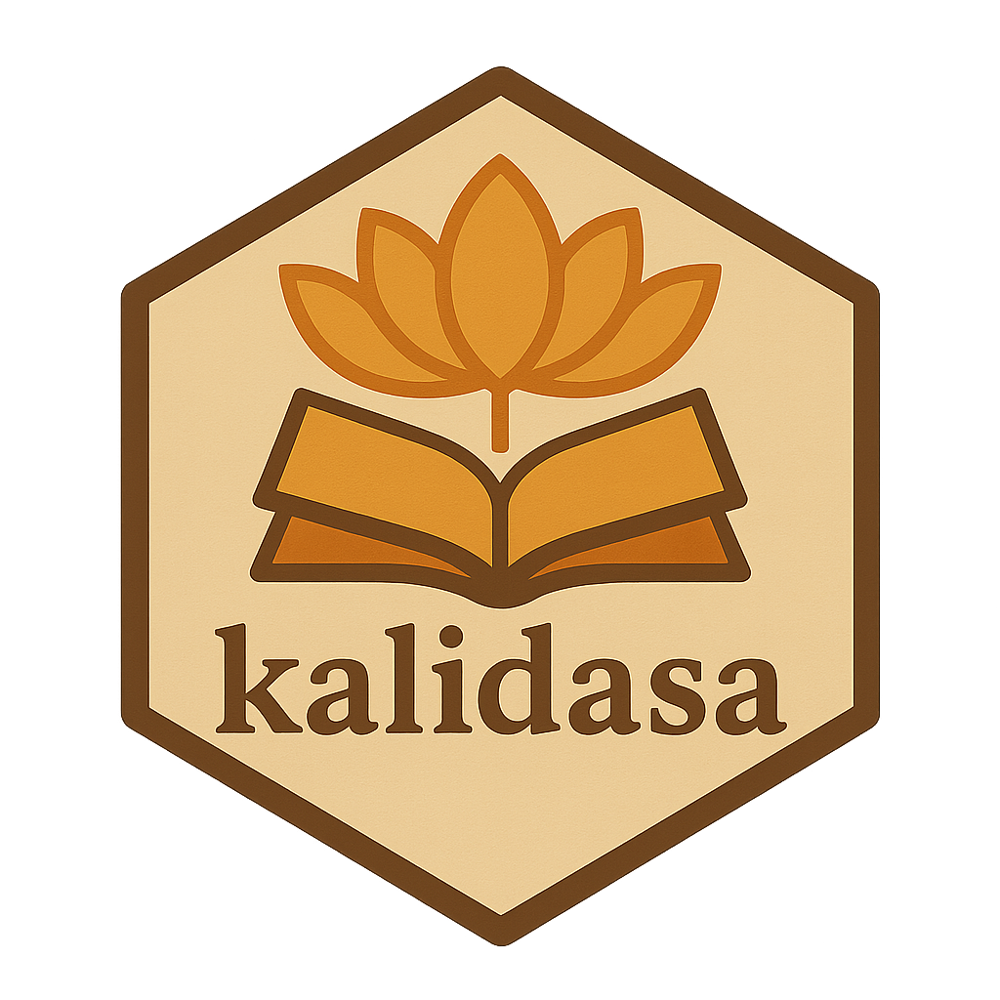

# kalidasa 

**kalidasa** is a repository of the data from the [Digital Corpus of
Sanskrit](http://www.sanskrit-linguistics.org/dcs/), designed for programmatic
text analysis. This is a work in progress.

## Roadmap

**kalidasa** will include three datasets and two functions. `dcs_meta` will
include corpus metadata for each text, including full title, author, time
period, and subject/genre. `dcs_raw` will include a list of character vectors
for each text, divided by chapter. Calling `unlist` on `dcs_raw` will return
a character vector of the entire text with one line of verse in each element.
`dcs_rich` will include lemmata data and grammatical analysis in a tidy format. 

There is also a function `remove_stopwords` which can be called on `dcs_raw` or
any subelement text to remove rows of data that are included in a custom
stoplist. The stopwords were generated according a hybrid approach of TF-IDF
scores, manual selection and the method described in [this
paper](https://ieeexplore.ieee.org/document/7976898). Lastly, there is a
function `dcs_write` which writes all the data to a location on disk and
returns a vector of filepaths.

## Attribution

All data was scraped from the DCS, which is prepared by Oliver Hellwig and licensed under CC-BY 4.0.
