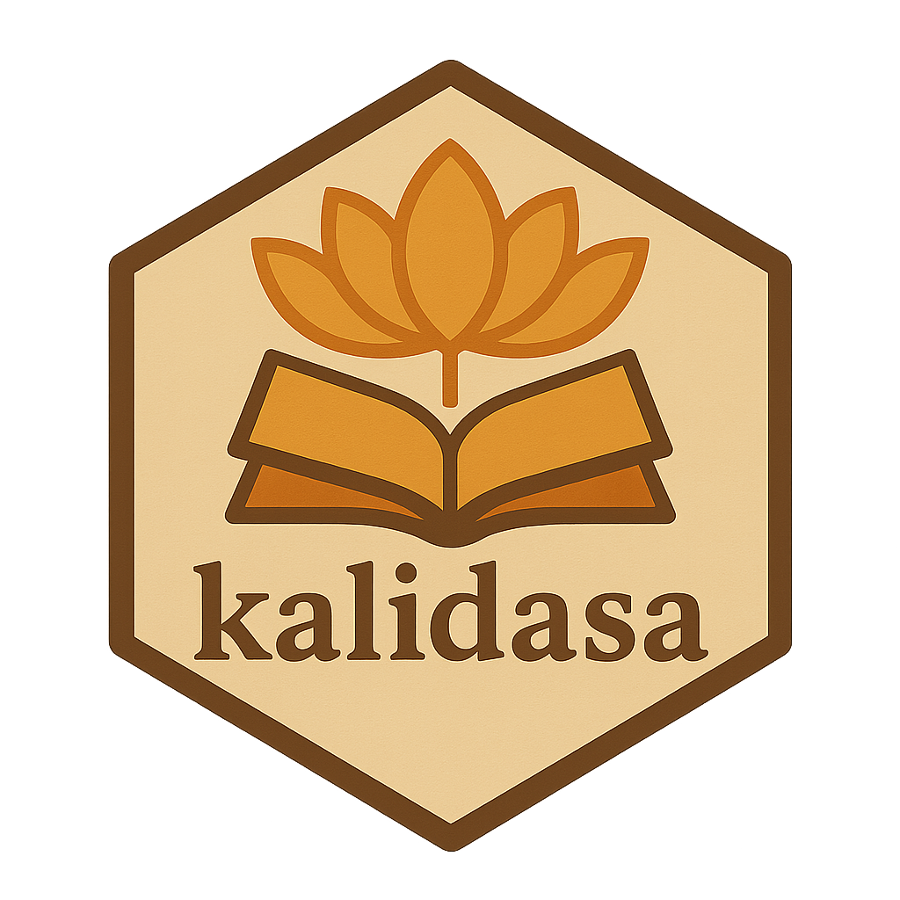

# kalidasa 

**kalidasa** is a repository of the data from the [Digital Corpus of
Sanskrit](http://www.sanskrit-linguistics.org/dcs/), designed for programmatic
text analysis. 

> [!IMPORTANT]
> This is a work in progress.

## The Project

**kalidasa** includes three datasets and several helper functions. `dcs_meta`
includes corpus metadata for each text, including full title, author, time
period, and subject/genre. `dcs_raw` includes a list of character vectors for
each text, divided by chapter. `dcs_rich` includes lemmata data and grammatical
analysis in a tidy format. 

### Helper Functions

There are several helper functions to make querying the data easier. Since all
of the texts and titles are transliterated according to the
[IAST](https://en.wikipedia.org/wiki/International_Alphabet_of_Sanskrit_Transliteration)
schema and encoded as UTF-8 text, **kalidasa** makes use of unique `text_id`s
to interface with the package data. These `text_id`s are consistent with the IDs
used in the DCS API. The function `print_titles` to list the available texts and
their `text_id` for easy lookup. `search_texts` does a fuzzy search for text
titles returning the top matches. `get_search` returns the `dcs_raw` data for
the top result of a query. `get_text`---aptly---gets the `dcs_raw` data for a
specificed `text_id` and optional chapter range.

There is also a function `remove_stopwords` which can be called on `dcs_rich`
or any subelement text to remove rows of data that are included in a custom
stoplist. The stopwords were generated according a hybrid approach of TF-IDF
scores, manual selection and the method described in [this
paper](https://ieeexplore.ieee.org/document/7976898). Lastly, there is a
function `dcs_write` which writes all the data to a location on disk and
returns a vector of filepaths.

## Attribution

All data was scraped from the DCS, which is prepared by Oliver Hellwig and
licensed under CC-BY 4.0.
